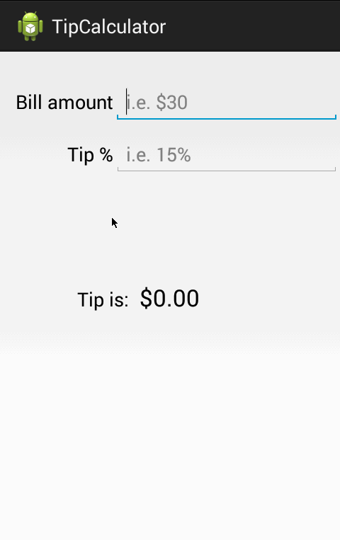

This is a tip Calculator utility app which allows a user to calculate the appropriate tip based on the total amount entered.

Time spent: 3 hours 

Completed user stories:

* [x] Required: User is displayed the tip of specified percentage for specified entered amount
* [x] Required: User enters the total amount of the transaction
* [x] Required: User can select between tip amounts (i.e 10%, 15%, 20%)
* [x] Required: Upon selecting tip amount, formatted tip value is displayed
 

Notes:

None

Walkthrough of all user stories:

